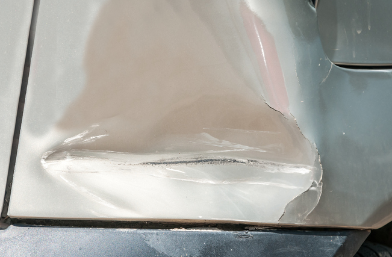
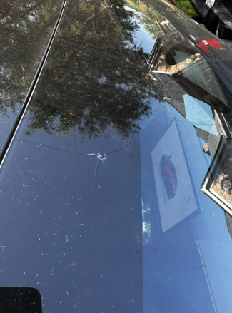
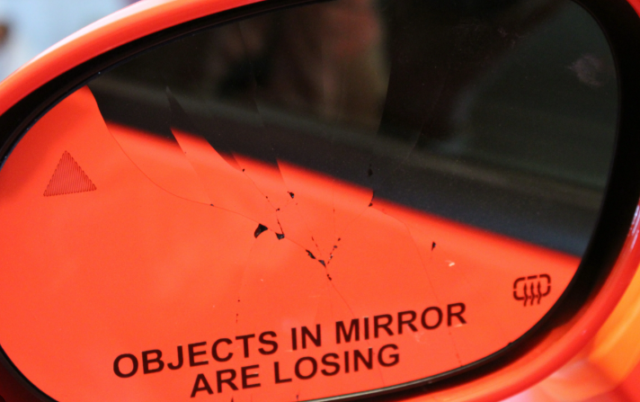
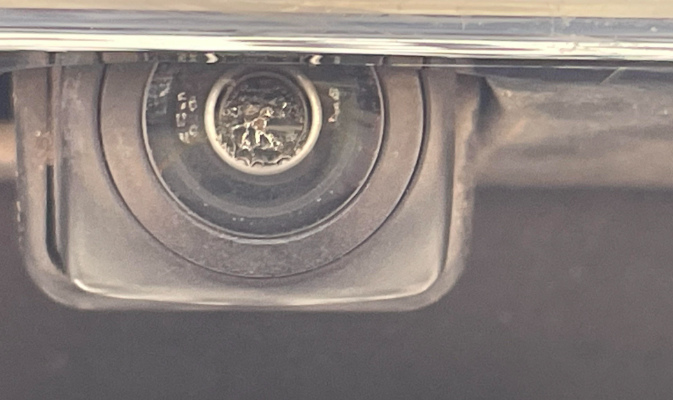
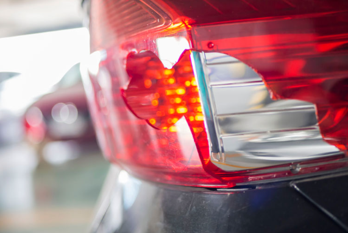
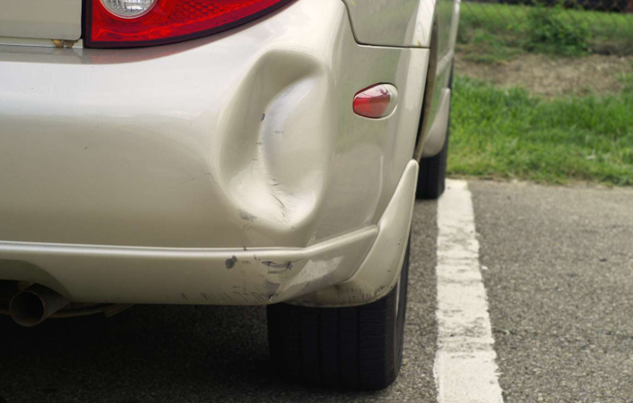

# Inspekcja nadwozia

Z jednej strony jest to najłatwiej dostępna część pojazdu, a z drugiej najbardziej złożona 
i podatna na najwięcej rodzajów uszkodzeń. 
Nadwozie składa się z kilku części, w tym elementy złożone z różnego rodzaju materiału. 
Podział rozpatrywanych uszkodzeń i modele je wykrywające można podzielić właśnie ze względu na materiał i lokalizację.

### Karoseria

Metalowe elementy osłonięte lakierem są podatne głównie na zarysowania oraz wgniecenia. 
Brak lakieru (spowodowany na przykład ekspozycją na mocne słońce pojazdów w niektórych szerokościach geograficznych)
może powodować błędnie wykrywane wgniecenia.
Pełna analiza uszkodzeń karoserii wymaga jednak analizy sporego obszaru pojazdu i wielu perspektyw.
Najczęściej uszkodzenia karoserii pojawiają się na krawędziach pojazdów, 
zarysowania i wgniecenia karoserii nierzadko idą w parze z uszkodzeniami innych elementów pojazdu.

### Szyba (przednia, tylna, boczne)

Najbardziej narażona na uszkodzenia jest przednia szyba. 
Możliwe uszkodzenia to pęknięcie (wymagające wymiany szyby) 
lub tak zwane bawole oko (bulleye), czyli okrągły, ukruszony fragment szyby, który wygląda jak ślad po pocisku. 
Pęknięcia są łatwo zauważalne, ale bulleye często może być mylony przez algorytm 
z ptasimi odchodami lub martwymi owadami.

### Lusterka

Analiza uszkodzeń lusterek wymaga dobrego uchwycenia ich przez kamerę (ze względu na mały obszar).
Nie pomaga też fakt, że od lusterka odbija się obraz.
Małe pęknięcia są ciężko widoczne, często mylone z odpryskami lub zaciekami z wody.
Dużo łatwiej jest wykryć pęknięte lusterko, którego fragment wyleciał z jego obudowy. 

### Elektronika (np. kamera cofania, antena)

Jeżeli kamera cofania lub inne elementy zewnętrznej elektroniki pojazdu znajdują się w tym samym miejscu dla
wszystkich testowanych pojazdów, ich zgubienie lub uszkodzenie daje się łatwo wykryć.
Podobnie jednak jak w przypadku lusterek i szyb, ciężko odróżnić pękniętą soczewkę kamery od ubrudzonej kamery.

### Światła i kierunkowskazy

Ciężkie do badania ze względu na małą powierzchnię. Zarysowana lub zanieczyszczona obudowa świateł (legalna jazda)
jest trudna do odróżnienia od pękniętych elementów (nielegalna jazda). 
Całkowicie odpadnięte kierunkowskazy są łatwiejsze do wykrycia.

### Elementy plastikowe (zderzak, błotniki, klamki)

Elementy narażone na podobne rodzaje uszkodzeń co karoseria, jednak dużo częściej i łatwiej zarysowywane i będące
wgniecione ze względu na słabszy materiał.

