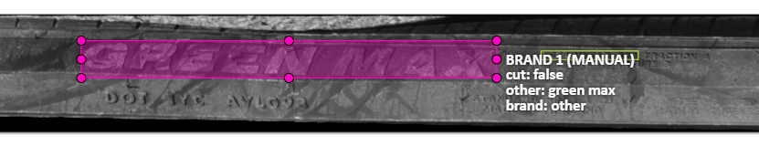
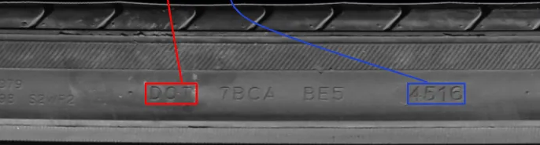
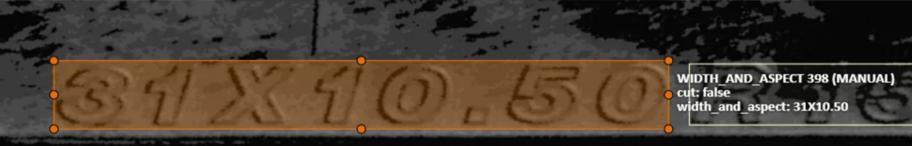
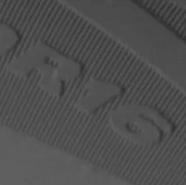
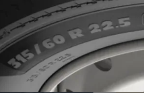
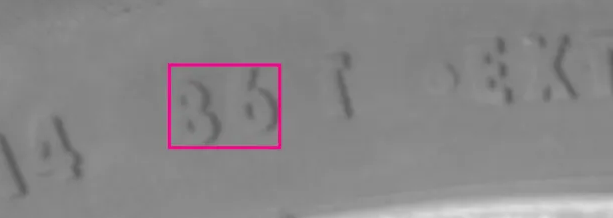
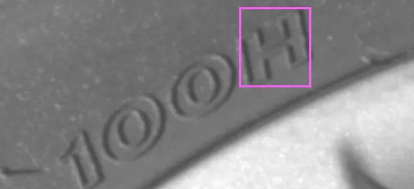
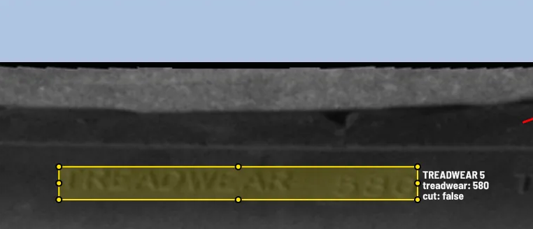

# Inspekcja opon

## W automatycznej inspekcji pojazdów, szczególnie flot samochodów dostawczych, ważna jest inspekcja opon.
Opony mogą cierpieć na szereg usterek, mniej lub bardziej uniemożliwiających dalszą jazdę.
Ponadto, z bocznego widoku opony można odczytać wszystkie techniczne informacje na ich temat.
W tym celu boczny widok można zamienić na długi obraz i spłaszczyć widok, 
dzięki czemu łatwiej jest odczytać wybite w gumie informacje.

Dla ostatecznie przekształconego obrazu stosuje się algorytm OCR (Optical Character Recognition).
Poniżej zostaną przybliżone wybrane parametry techniczne i informacje dotyczące opon, 
które można odczytywać dzięki takiemu algorytmowi.

#### Marka opony

#### Numer dot

Jest to data produkcji opony w formacie `WWYY`, czyli tydzień plus rok. 
Na przykład 4616 oznacza 46. miesiąc roku 2016. 
Prawo niektórych krajów wymaga korzystania z opon nie starszych niż X lat 
(niezależnie od faktycznego stanu i jakości materiału),
więc kontrola numeru dot pomaga wykrywać czas, kiedy opony stracą ważność.

#### Rozmiar (szerokość oraz wysokość od bieżnika do felgi)

#### Średnica

#### Maksymalna ładowność

#### Maksymalna prędkość

#### Odporność na ścieranie bieżnika

## Ciśnienie, przecięcia oraz felga

Boczny widok opony (bez użycia spłaszczenia) jest dobry do wykrywania usterek związanych z 
nieprawidłowym ciśnieniem w oponach oraz jakością gumy.

#### Flat tire (kapeć)

Przebita opona lub spadek ciśnienia powietrza w oponach może być wykrywane przez algorytm analizujący ogólny kształt
boczny opony, w przypadku jednej z tych usterek widać, że opona jest bardziej płaska na styku z nawierzchnią.

#### Bulge (wybrzuszenie)

Spadek ciśnienia to jednak nie jedyna możliwa usterka, bardziej groźne jest wybrzuszenie, które prowadzić może do 
wystrzału opony podczas jazdy. Bulge charakteryzuje się wybrzuszeniem na zewnątrz opony, 
często jednak są to niewielkie wybrzuszenia, a dodatkowo jest to bardzo rzadki rodzaj usterki 
(bardzo mały zbiór treningowy), przez co jest trudno wykrywalne przez algorytm.

#### Przecięcia opony

Innymi częstymi usterkami są przecięcia opony (dobrze widoczne głównie, gdy są rozległe) 
oraz związane z wiekiem, parcenie gumy.

#### Uszkodzenie felgi

Taki widok pozwala również analizować uszkodzenia samej felgi, od jej przetarcia, 
aż po groźniejsze przypadki np. pęknięcie felgi, odkręcenie lub brak śrub mocujących felgi.  

## Bieżnik i obce obiekty

Podczas przejazdu pojazdu można wykonać również zdjęcie bieżnika i przeanalizować go.
Do analizy głębokości rowków powinien posłużyć osobny alorytm. 
Ciężko jednak wyznaczyć dokładną głębość bieżnika, dochodzi tutaj również perspektywa oraz
nierównomierne zużycie bieżnika w obrębie pojedynczej opony. 
Nowe opony mają również "Igiełki" podobne w wyglądzie do włosków, które zakłócają obraz bieżnika.
Są to cienkie fragmenty gumy będące pozostałością formowania opony podczas procesu produkcji.

Taka perspektywa opony pozwala również na odnajdywanie obcych obiektów w oponie,
których obecność grozi niesprawnością opony przy pewnych okolicznościach. 
Obcymi obiektami jest najczęściej szkło, gwoździe i inne kawałki metalu. 
Ich obecność grozi przebiciem i niesprawnością opony.

Algorytm odnajdywania obcych obiektów jest jednak o tyle ciężki do stworzenia, 
że wbite przedmioty w ogólności nie będą groźne dla dalszej jazdy. 
W związku z grubością bieżnika, podczas jazdy w opony wbija się dużo małych kamieni, 
które są bardzo ciężko odróżnialne od na przykład zabrudzonej główki gwoździa. 
Obecność kamieni w oponie nie stanowi jednak zagrożenia, więc takie algorytmu mogą borykać się z wysokim procentem
false detection.