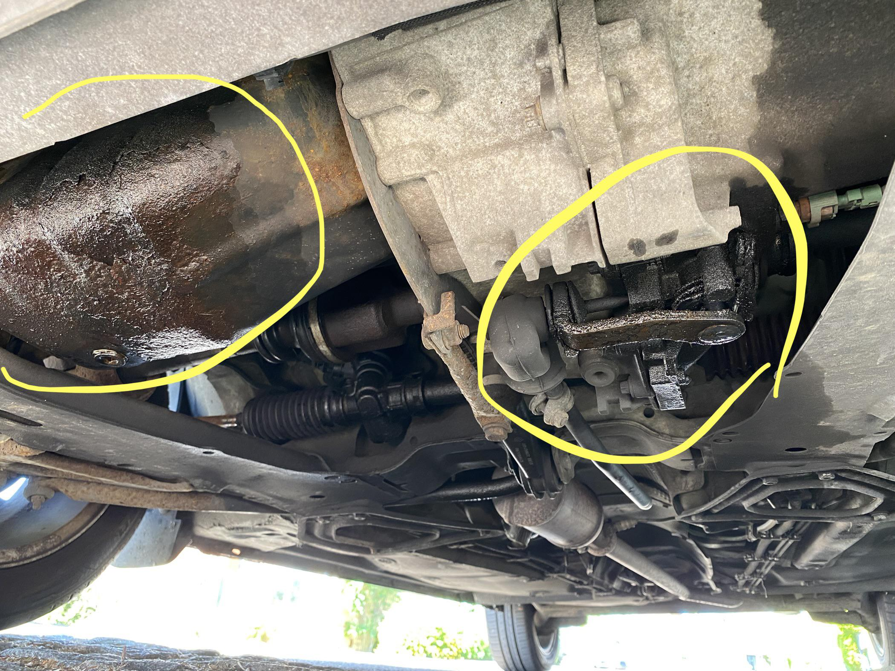
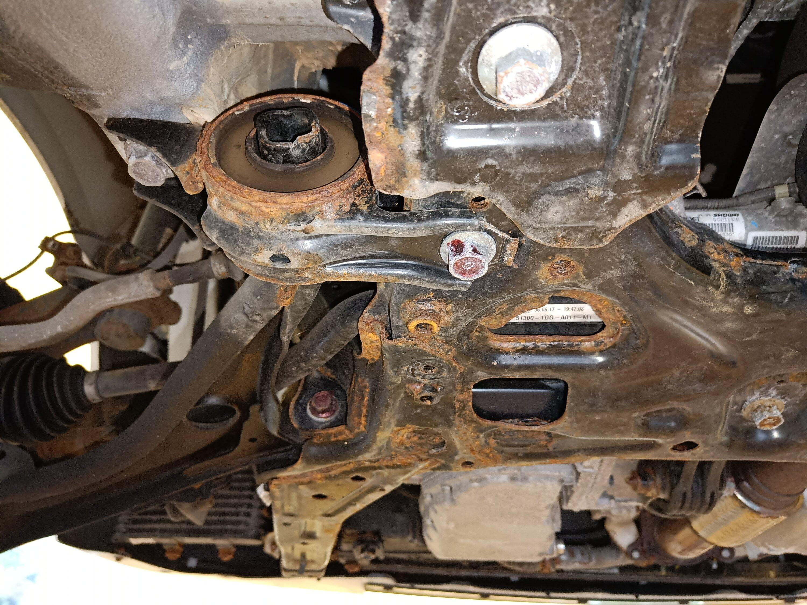
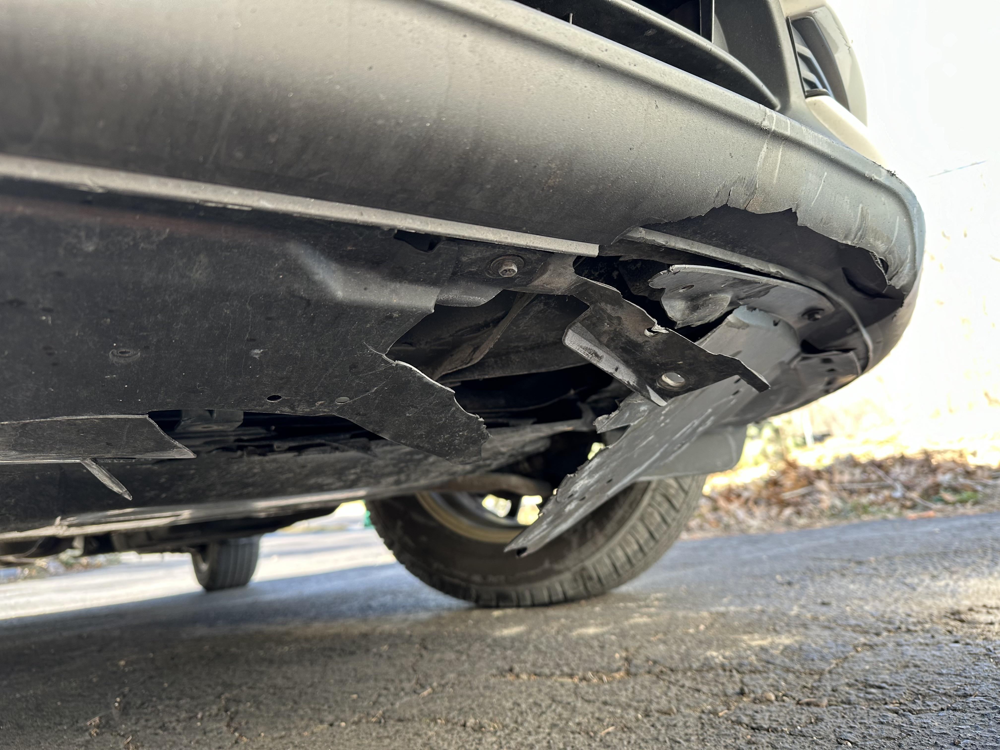
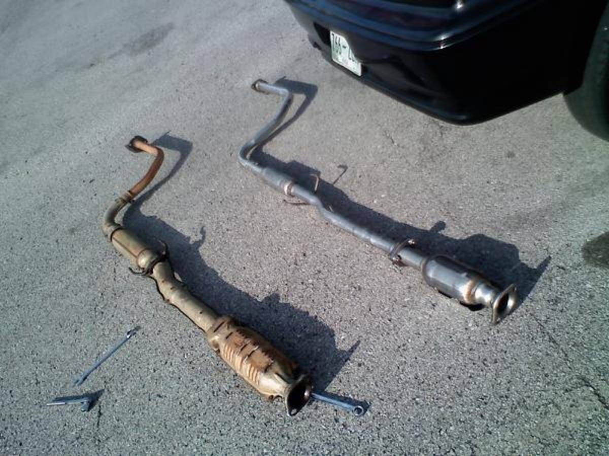

# Inspekcja podwozia

Jest na najtrudniej dostępna część podczas pełnej inspekcji pojazdu.

### Wyciek oleju

### Rdza

### Dziurawe lub przetarte elementy podwozia

### Wycięty katalizator

### Przerwane kable

Na przykład przez gryzonie lub przez wystawienie na działanie wody, brudu itp.